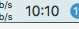
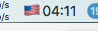

# Multi country menubar Clock

A toggable clock that switches between timezone.

Call init with a table containing the various TZ you want to be able to list:

```lua
{
      {
        clock = 3600,
        prefix = "🇫🇷"
      },
      {
        clock = -5 * 3600,
        prefix = "🇺🇸"
      }
}
```




If your current timezone is the one you are viewing